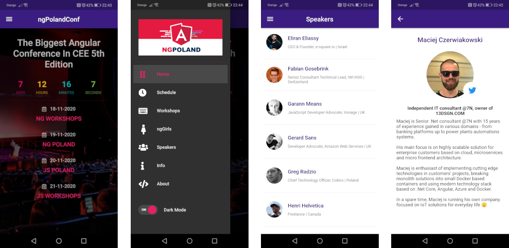

The official app for ngPoland and jsPoland conference.

Now completely rewritten with Flutter 🚀

It is faster, prettier, and more powerful 💪

If you would like to help us, you're welcome. There will be always something you can work on.

You can download the app here:
- Android: [https://play.google.com/store/apps/details?id=pl.ngPoland.ngPolandConf](https://play.google.com/store/apps/details?id=pl.ngPoland.ngPolandConf)
- iOS: coming soon

#

